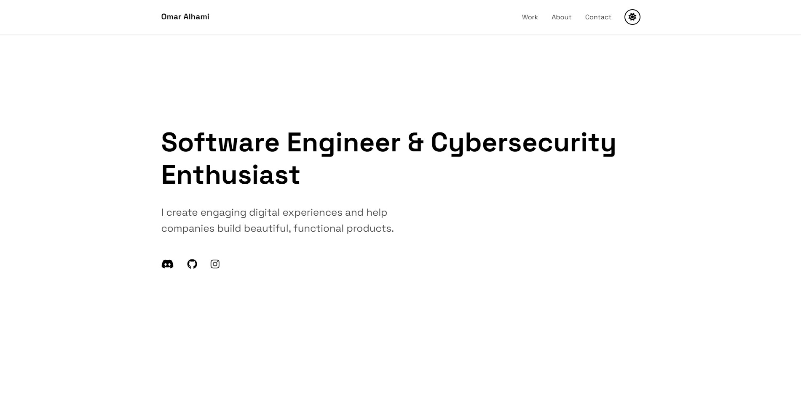

# Omar Alhami's Portfolio

## Description
Welcome to my portfolio! This website showcases my work as a Software Engineer. Here, you can find various projects that highlight my skills and creativity.

## Preview


## Live View
You can view the live version of my portfolio at: [https://omaralhami.netlify.app/](https://omaralhami.netlify.app/)

## Features
- **Custom Cursor**: An interactive cursor that enhances user experience.
- **Responsive Design**: Optimized for all devices, ensuring usability on desktops, tablets, and mobile phones.
- **Smooth Animations**: Engaging animations for a modern look and feel.
- **Project Showcase**: Detailed descriptions of projects with links to live demos and source code.

## Technologies Used
- HTML
- CSS
- JavaScript
- Font Awesome for icons

## Installation Instructions
1. Clone the repository:
   ```bash
   git clone https://github.com/OmarAlhami/your-repo-name.git
   ```
2. Navigate to the project directory:
   ```bash
   cd your-repo-name
   ```
3. Open `index.html` in your browser to view the portfolio.

## Usage
Feel free to explore my projects and contact me for any inquiries or collaborations!

## License
This project is licensed under the MIT License - see the [LICENSE](LICENSE) file for details.

## Contact
- GitHub: [OmarAlhami](https://github.com/OmarAlhami)
- Email: omar.alhami@outlook.com

---
Thank you for visiting my portfolio!